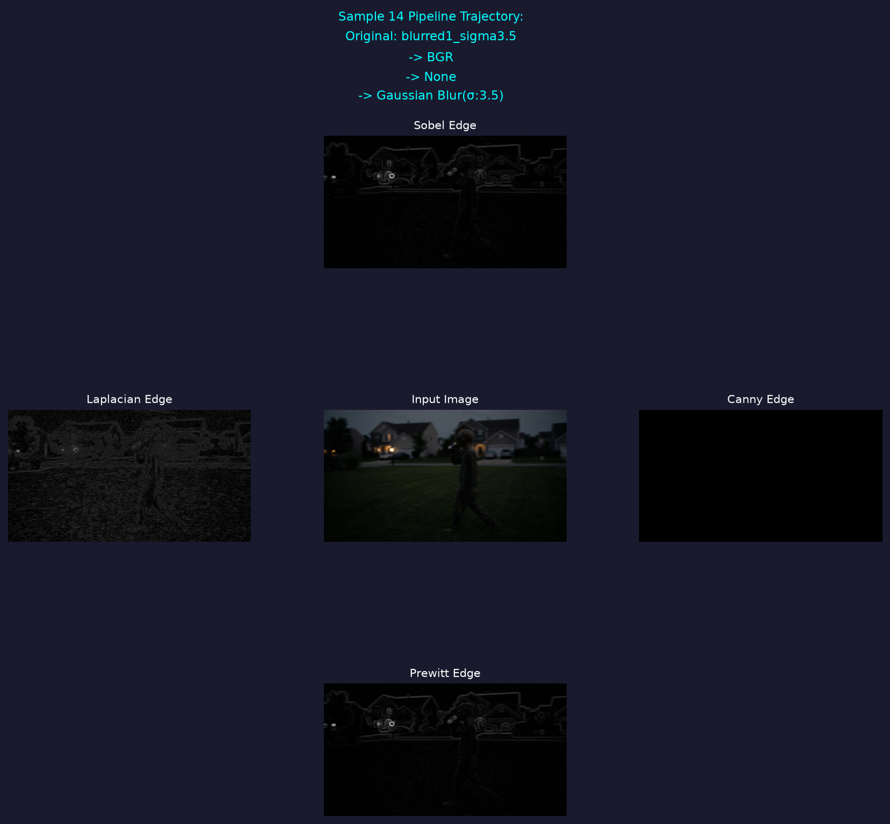
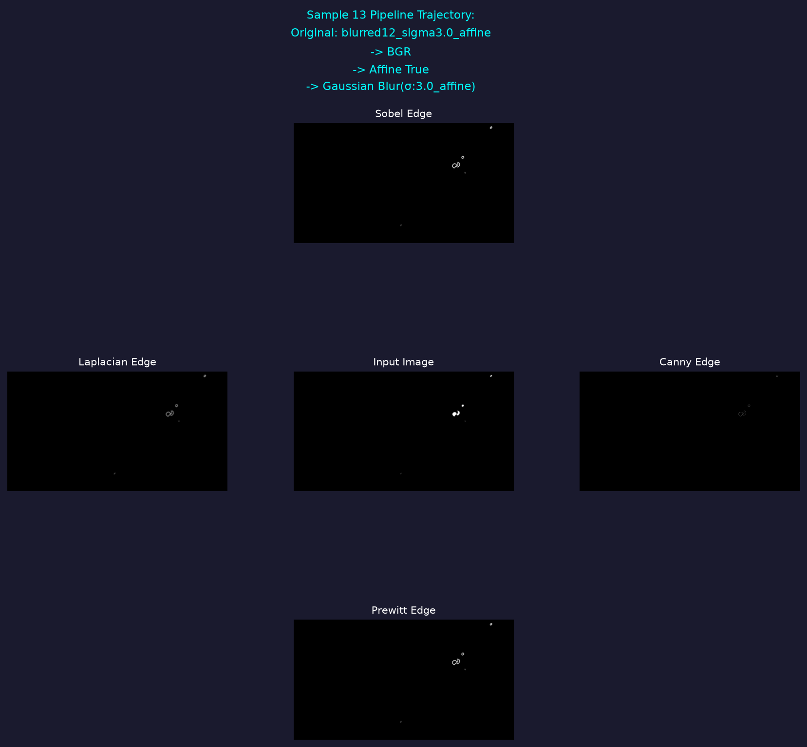
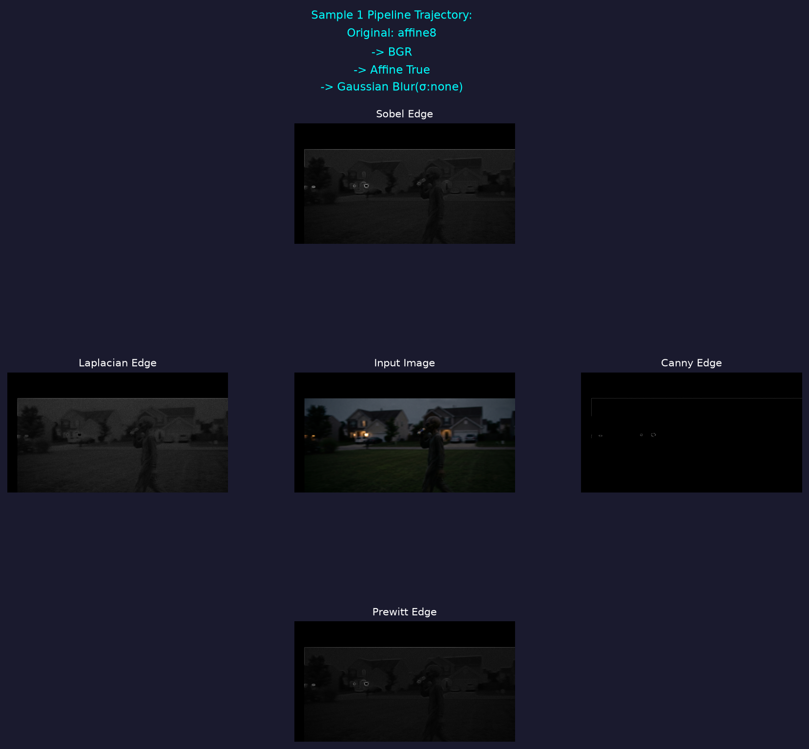
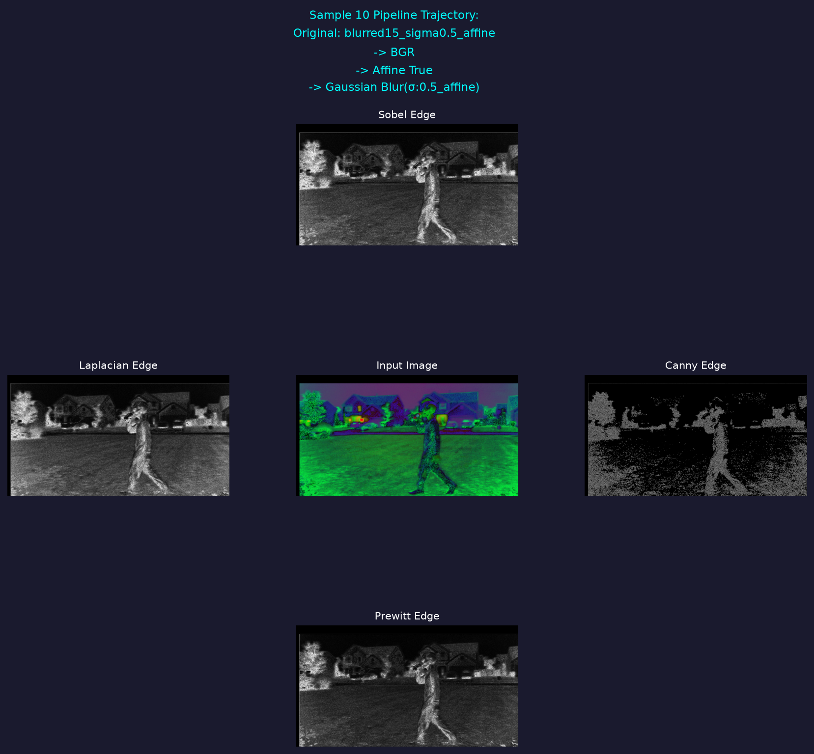
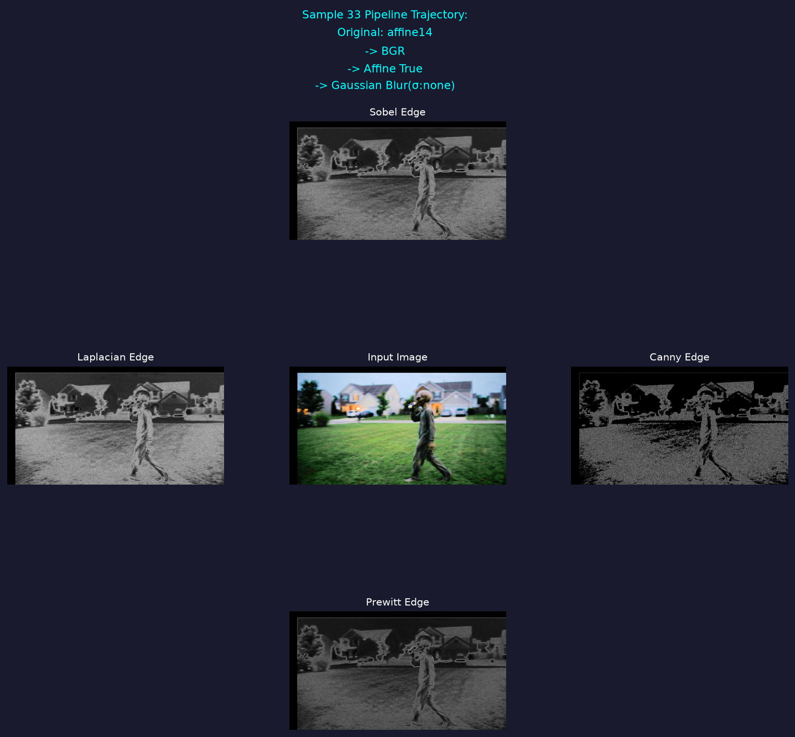
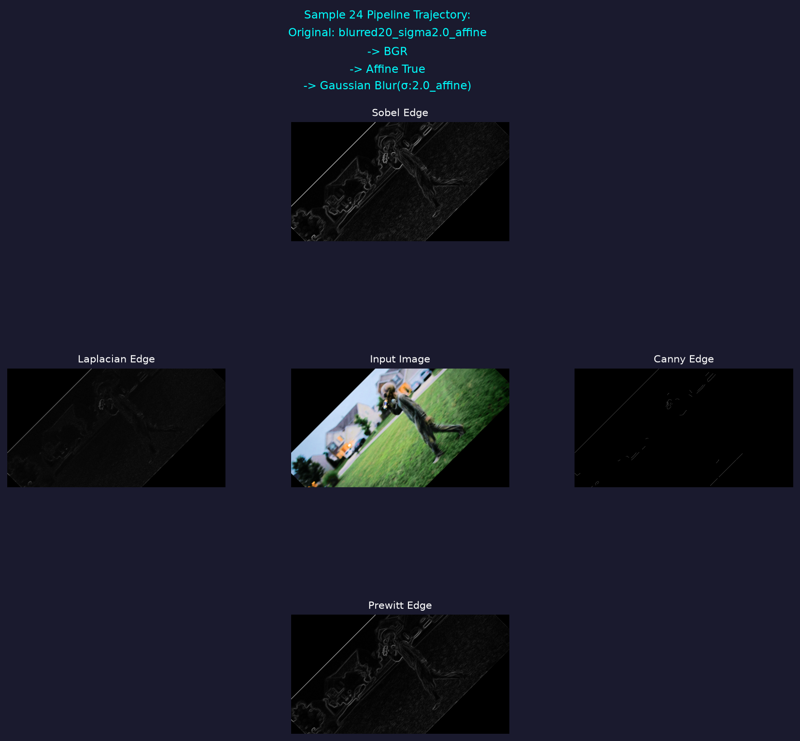

# README for HW1

## Setup

- setup venv with requirements from the main readme in the base directory
- make directory for Part2_Pictues and Part3_pictures

## Code Explanation

### Part 2

1. start by reading the img with ```img = cv.imread("./Pictures/HW1_IMG_CS898BA.png")```

2. then I printed the shape of the img variable which gave ```(1536, 2816, 3)```
   1. did the shape because openCV stores images as a numpy array
   2. the 3 represents the channels which in this case is BGR (Blue Green Red)
3. For Part 2.1, I just loopover each of the 3 channels
   1. To get stats I use built in functions from numpy and scipy and then just print out each all the stats
4. For Part 2.2, I use ```cvtColor()``` which takes in the image and a flag like COLOR_BGR2GRAY or THRESH_BINARY to do color conversions
5. Then after each conversion ```cv.imwrite()``` is used to save each image in the pictures folder
6. 2.3, 2.4
   1. ```h, s, v = cv.split(hsv)``` splits the hsv image from the previous step into its individual channels
   2. ```v = cv.equalizeHist(v)``` does histogram equalization on the v channel
   3. ```hsv = cv.merge([h,s,v])``` merges the channels back together
   4. ```normalized = cv.cvtColor(hsv, cv.COLOR_HSV2BGR)``` changes the image back to RGB
   5. ```cv.imwrite('./Pictures/Normalized_hsv_image.png', normalized)``` saves the image
7. 2.6
   1. First a list is made of all the current images and then the rows and cols are retrieved by getting the shape of the original image. A allImages list is also made which will hold all 21 images for 2.8
   2. Then the list is looped over with a rotation happening on each image then a translation. 
   3. Then each image is saved
8. 2.8
   1. A list of the sigma values is made
   2. Then I loop over all the images and for apply a gaussian blur for each sigma level

### Part 3 Explanations

1. Started off by getting my subset of 42 images from part 2 by parsing the directorys for files ending in .png
2. Then I looped over the 42 images and did the following
   1. defined the prewitt matrices as defined in the slides
   2. took out the .png from the filename which was done by `_file_name = file_name[:-4]`
   3. if it had blurred at the beginning then I removed the first 15 characters so that I could get rid of the "blurred_images/" string
   4. loaded the image with cv.imread
   5. turned the image into grayscale
   6. did all edge detection techniques 
   7. saved all images then appended images to the list I had made earlier to store them so they're easy to plot
   8. I then create the plot for step 3.8 using a grid. (NOTE: I didn't include the transformation information when I did the affine transformations so that information is missing and just says affine true since my naming convention was poor. Also missing information from when I did the original color space changes)

#### 3.5 discussion

##### Pros and cons:

Sobel: 
Pros - unlike Prewitt it has weights on the center rows and columns of the kernel which makes it better than prewitt when it comes to noisy images
Cons - requires more computation cost due to the weights than prewitt, since it has weights it also has a chance to miss very subtle edges

Laplacian:
Pros - omnidirectional edge detection instead of just vertical or horizontal
Cons - sensitive to noise and grainy images like the base image

Canny:
Pros - good noise sepression and good for getting the shape of an image
Cons - had to hardcode the thresholds and since the images were all over the place being bright and dark there was no real good threshold to capture everything

Prewitt:
Pros - works well with images that aren't very noisy
Cons - unweighted kernels since everything is 1s or 0s which means its more sensitive to noise which is seen in how some of the images are getting the grass as an edge

**The best techniques**: From looking at the images, sobel and prewitt seemed to give the best results overall and most consistent results. 

#### 6 random Plots

I just typed in plot and held down the down arrow and randomly stopped






