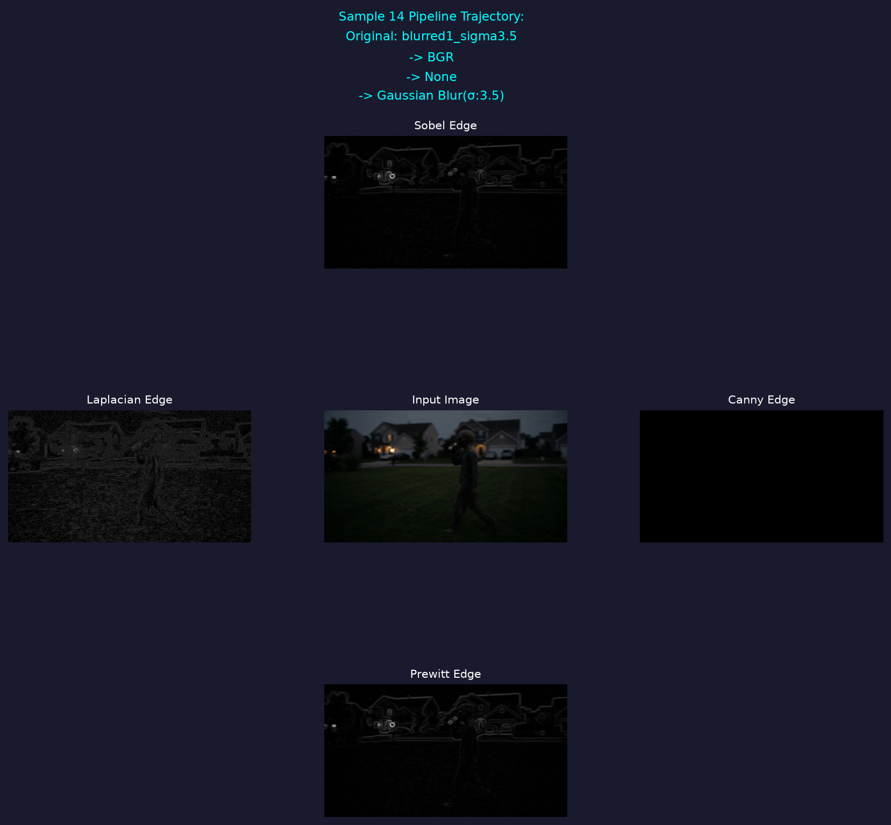
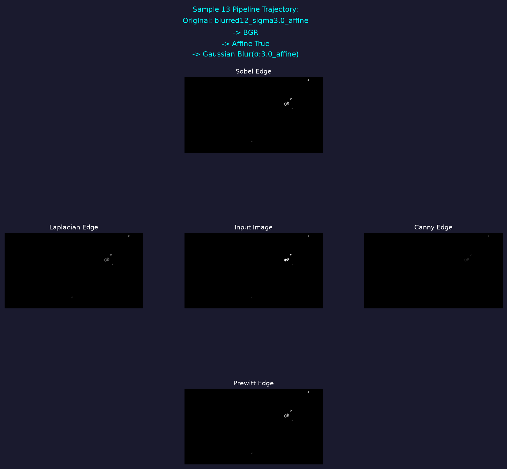
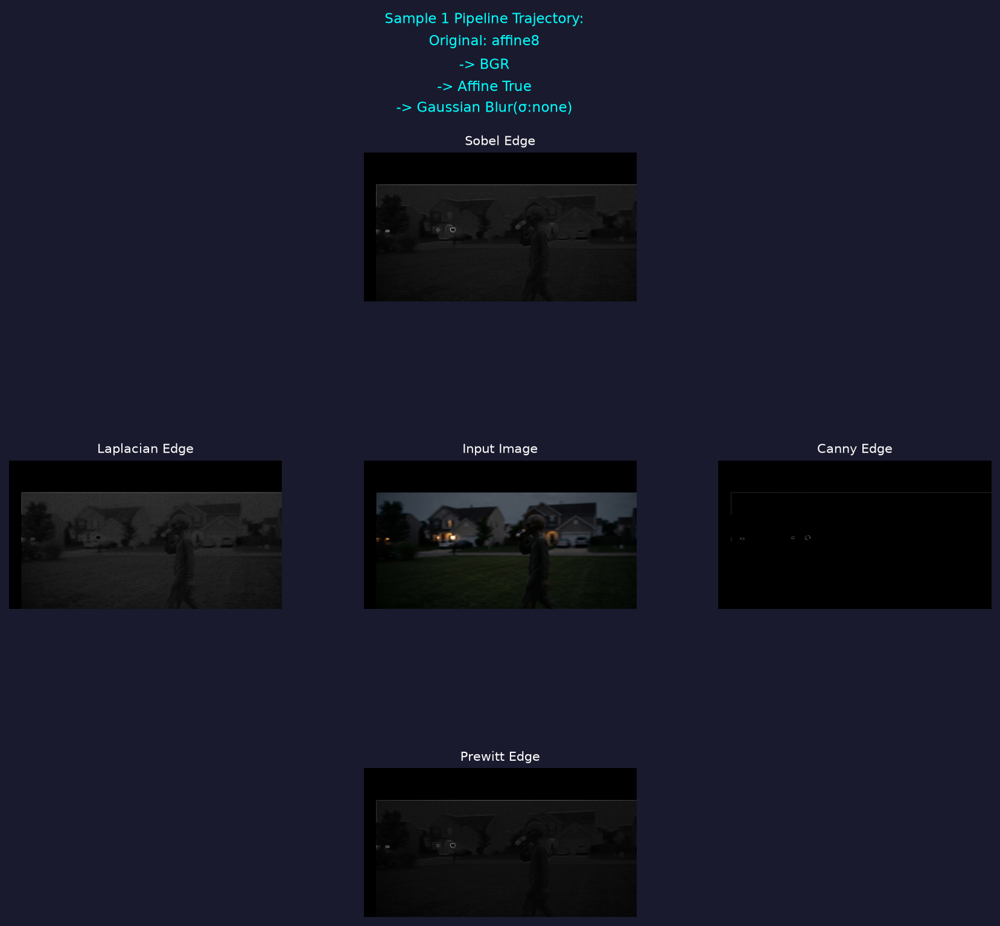
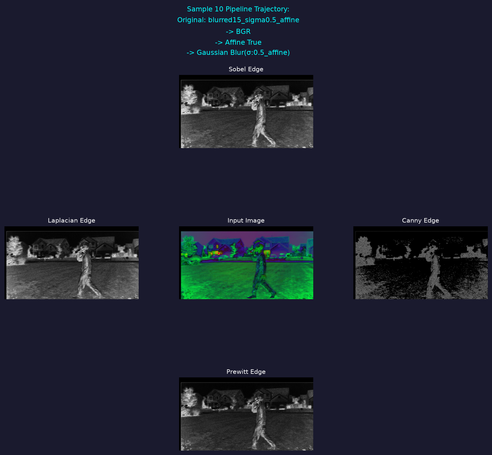
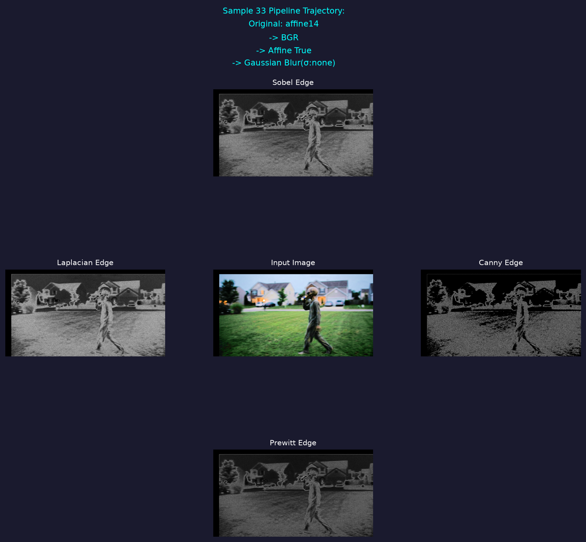
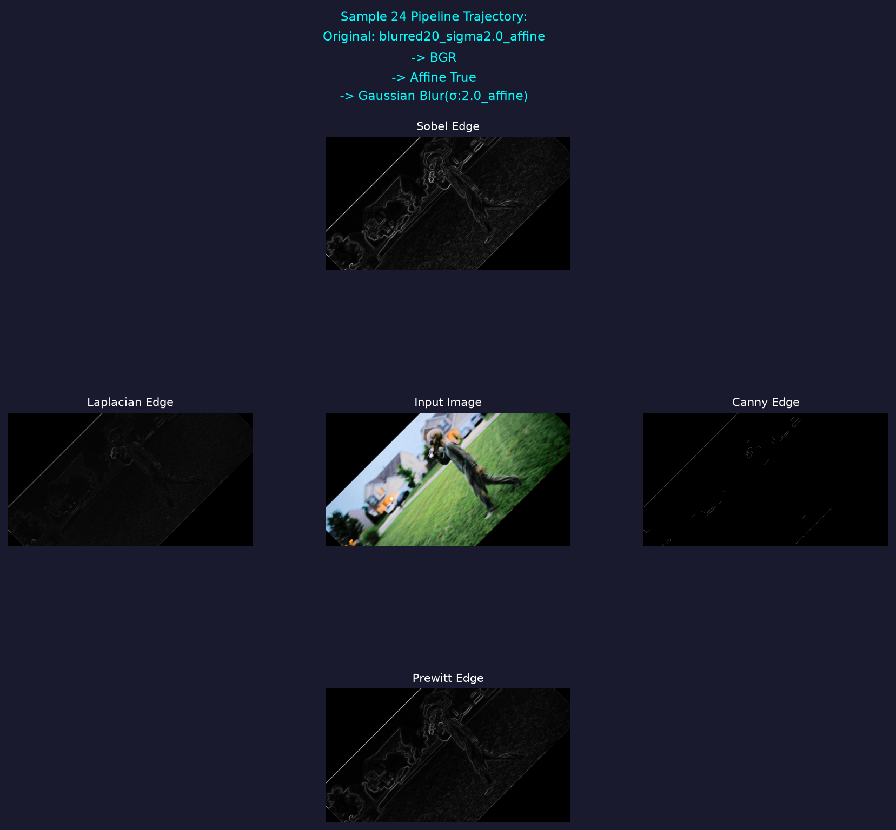
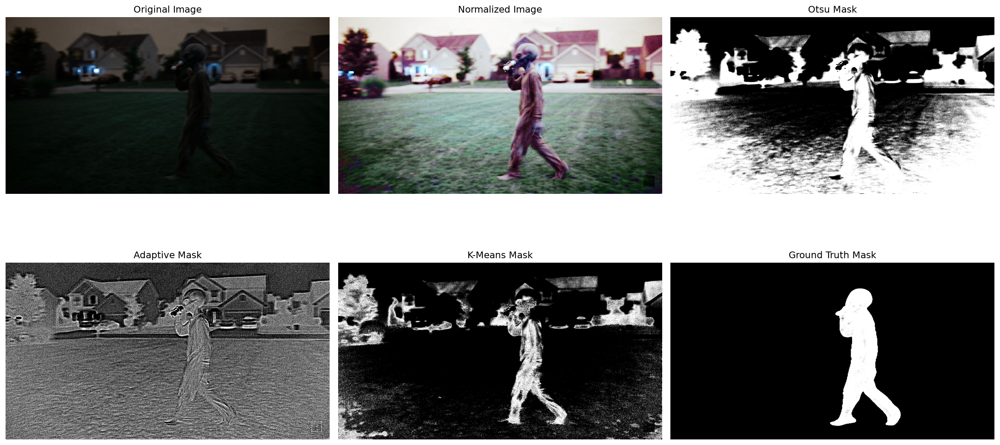

# README for Homeworks

## Directory Structure

```
├── Part2_Pictures/       # Picture outputs from Homework 1 Part 2 code
│   ├── blurred_images/   # All blurred images from Homework 1 Part 2
├── Homework_3/           # Homework 3 files
├── Hw2_Pictures/         # Picture outputs from Homework 2 code (HW2.ipynb)
├── Part3_Pictures/       # Picture outputs from Homework 1 Part 3 code
└── AI_Log.md             # Ai usage log file
└── HW1.ipynb             # Code for Homeowork 1
└── HW2.ipynb             # Code for Homeowork 2
└── README.md.            # Contains structure, setup and explanations of code
```


## Setup

- setup venv with requirements from the main readme in the base directory
- make directory for Part2_Pictues and Part3_pictures

## Code Explanation

### Part 2

1. start by reading the img with ```img = cv.imread("./Pictures/HW1_IMG_CS898BA.png")```

2. then I printed the shape of the img variable which gave ```(1536, 2816, 3)```
   1. did the shape because openCV stores images as a numpy array
   2. the 3 represents the channels which in this case is BGR (Blue Green Red)
3. For Part 2.1, I just loopover each of the 3 channels
   1. To get stats I use built in functions from numpy and scipy and then just print out each all the stats
4. For Part 2.2, I use ```cvtColor()``` which takes in the image and a flag like COLOR_BGR2GRAY or THRESH_BINARY to do color conversions
5. Then after each conversion ```cv.imwrite()``` is used to save each image in the pictures folder
6. 2.3, 2.4
   1. ```h, s, v = cv.split(hsv)``` splits the hsv image from the previous step into its individual channels
   2. ```v = cv.equalizeHist(v)``` does histogram equalization on the v channel
   3. ```hsv = cv.merge([h,s,v])``` merges the channels back together
   4. ```normalized = cv.cvtColor(hsv, cv.COLOR_HSV2BGR)``` changes the image back to RGB
   5. ```cv.imwrite('./Pictures/Normalized_hsv_image.png', normalized)``` saves the image
7. 2.6
   1. First a list is made of all the current images and then the rows and cols are retrieved by getting the shape of the original image. A allImages list is also made which will hold all 21 images for 2.8
   2. Then the list is looped over with a rotation happening on each image then a translation. 
   3. Then each image is saved
8. 2.8
   1. A list of the sigma values is made
   2. Then I loop over all the images and for apply a gaussian blur for each sigma level

### Part 3 Explanations

1. Started off by getting my subset of 42 images from part 2 by parsing the directorys for files ending in .png
2. Then I looped over the 42 images and did the following
   1. defined the prewitt matrices as defined in the slides
   2. took out the .png from the filename which was done by `_file_name = file_name[:-4]`
   3. if it had blurred at the beginning then I removed the first 15 characters so that I could get rid of the "blurred_images/" string
   4. loaded the image with cv.imread
   5. turned the image into grayscale
   6. did all edge detection techniques 
   7. saved all images then appended images to the list I had made earlier to store them so they're easy to plot
   8. I then create the plot for step 3.8 using a grid. (NOTE: I didn't include the transformation information when I did the affine transformations so that information is missing and just says affine true since my naming convention was poor. Also missing information from when I did the original color space changes)

#### 3.5 discussion

##### Pros and cons:

Sobel: 
Pros - unlike Prewitt it has weights on the center rows and columns of the kernel which makes it better than prewitt when it comes to noisy images
Cons - requires more computation cost due to the weights than prewitt, since it has weights it also has a chance to miss very subtle edges

Laplacian:
Pros - omnidirectional edge detection instead of just vertical or horizontal
Cons - sensitive to noise and grainy images like the base image

Canny:
Pros - good noise sepression and good for getting the shape of an image
Cons - had to hardcode the thresholds and since the images were all over the place being bright and dark there was no real good threshold to capture everything

Prewitt:
Pros - works well with images that aren't very noisy
Cons - unweighted kernels since everything is 1s or 0s which means its more sensitive to noise which is seen in how some of the images are getting the grass as an edge

**The best techniques**: From looking at the images, sobel and prewitt seemed to give the best results overall and most consistent results. 

#### 6 random Plots

I just typed in plot and held down the down arrow and randomly stopped








# Part for HW2

### Part 2

```
# Part 2

import cv2 as cv
import numpy as np
from pathlib import Path

#BGR
img = cv.imread("./Part2_Pictures/HW1_IMG_CS898BA.png")

b = img[:, :, 0]
g = img[:, :, 1]
r = img[:, :, 2]

b = cv.equalizeHist(b)
g = cv.equalizeHist(g)
r = cv.equalizeHist(r)
equalized_img = cv.merge([b, g, r])
```

- All this code does is import the necessary libraries then load the image. Since the img comes in as a numpy array I split it by slicing it. Then I apply Histogram Equalization on each channel individually by calling the function then I merge the channels together

### Part 3

```
# Part 3

grayscale = cv.cvtColor(normalized_img, cv.COLOR_BGR2GRAY)

ret, otsu = cv.threshold(grayscale, 0, 255, cv.THRESH_BINARY_INV + cv.THRESH_OTSU)
show_image(otsu, "Otsu's Global Thresholding")

gauss = cv.adaptiveThreshold(grayscale, 255, cv.ADAPTIVE_THRESH_GAUSSIAN_C, cv.THRESH_BINARY_INV, 31, 5)
show_image(gauss, "Adaptive Thresholding")

cv.imwrite("./Hw2_Pictures/OtsuGlobalThresholding.png", otsu)
cv.imwrite("./Hw2_Pictures/AdaptiveThresholding.png", gauss)

otsu_fg = cv.bitwise_and(normalized_img, normalized_img, mask=otsu)
gauss_fg = cv.bitwise_and(normalized_img, normalized_img, mask=gauss)
cv.imwrite("./Hw2_Pictures/OtsuForeground.png", otsu_fg)
cv.imwrite("./Hw2_Pictures/AdaptiveForeground.png", gauss_fg)
```

- The normalized image from the previous part is grayscaled then otsu.
  - otsu params:
    - grayscale image
    - placeholder thresholder since otsu ignores it
    - 255 value given to mixels if they meet the thresh hold value
    - THRESH_BINARY_INV was used here instead of THRESH_BINARY due to the image being dark and THRESH_OTSU was used to tell openCV to use OTSU's algorithm
- The image is then shown and then adaptive threshing holding is done on the grayscaled image
  - adaptive thresholding params:
    - grayscale image is the image we're working on
    - 255 is the max value and is same as otsu
    - ADAPTIVE_THRESH_GAUSSIAN_C is the method
    - THRESH_BINARY_INV is the same as otsu
    - 31 is the block size that the algorithm looks at. So its looking at a 31x31 block for every pixel
    - 5 is the amount that is subtracted after math is done
- foregrounds of each image is then extracted with the AND and then foregrounds are saved

### Part 4
```
# Part 4

hsv_normalized = cv.cvtColor(normalized_img, cv.COLOR_BGR2HSV)

pixel_vals = hsv_normalized.reshape((-1,3))
pixel_vals = np.float32(pixel_vals)

# 100 iterations, 85% acc
criteria = (cv.TERM_CRITERIA_EPS + cv.TERM_CRITERIA_MAX_ITER, 100, 0.85)
k = 5
retval, labels, centers = cv.kmeans(pixel_vals, k, None, criteria, 10, cv.KMEANS_RANDOM_CENTERS)

centers = np.uint8(centers)
segmented_data = centers[labels.flatten()]

segmented_image = segmented_data.reshape((hsv_normalized.shape))

show_image(segmented_image, "segmented image")
cluster_num = 4

mask = np.uint8(labels.flatten() == cluster_num) * 255
mask = mask.reshape(hsv_normalized.shape[:2])

foreground = cv.bitwise_and(normalized_img, normalized_img, mask=mask)

show_image(foreground, "Isolated Cluster")
show_image(mask, "Mask")

cv.imwrite("./Hw2_Pictures/Kmeans_foreground.png", foreground)
cv.imwrite("./Hw2_Pictures/Kmeans_mask.png", mask)
```

1. first the imaged is turned into the HSV color space and normalzied. Then since opencv required float32 for k-means the pixels values are all turned to float32
2. the criteria for my kmeans is that if 100 iterations happens or if the custers move by less than 85%. k = 5 is for 5 clusters
3. k means is then ran and everthing is passed, the 10 variable means that it'll run 10 times and return the best result
4. centers are then separated and I picked the 5th cluster since I ran checked all the clusters and the last cluster gave the correct 4 ground.
5. The mask is then turned into a binary mask and teh foreground is extract with the same method as with otsu and adapative thresholding
6. images are then shown and saved

### Part 5

```
# Part 5

mask_gt = cv.imread("./Hw2_Pictures/MASK.png")
mask_gt = cv.cvtColor(mask_gt, cv.COLOR_BGR2GRAY)
_, mask_gt = cv.threshold(mask_gt, 0, 255, cv.THRESH_BINARY)
show_image(mask_gt, "mask")
cv.imwrite("./Hw2_Pictures/ground_truth.png", mask_gt)

# Part 5.2 

def metrics(mask, gt):
    mask = mask.astype(bool)
    gt = gt.astype(bool)
    intersect = np.logical_and(mask, gt)
    union = np.logical_or(mask, gt)
    mag_int = intersect.sum()
    mag_union = union.sum()
    iou = mag_int / mag_union
    
    # dice 
    dice = (2 * mag_int) / (mask.sum() + gt.sum())
    return iou, dice

masks = [otsu, gauss, mask]

iou, dice = metrics(masks[0], mask_gt)
print(f"Otsu: IoU = {iou:.4f}, Dice = {dice:.4f}")

iou, dice = metrics(masks[1], mask_gt)
print(f"gauss: IoU = {iou:.4f}, Dice = {dice:.4f}")

iou, dice = metrics(masks[2], mask_gt)
print(f"K-Means: IoU = {iou:.4f}, Dice = {dice:.4f}")
```

1. the mask of the figure is brought in and and turned into a binary mask and saved as the ground truth. The mask I made doesn't have a background so all pixels were just turned white
2. I then define a metrics function which computes the iou and dice coeffcient 



#### 5.1 Qualitative analysis

*Discuss the pros and cons of each approach regarding background noise (e.g., leaves, porch structures) and edge preservation of the central figure. Specifically note how color normalization across all three channels impacted the final segmentation compared to the raw image results from Homework One.*

**Otsu**: otsu did well at capturing the shape of the figure however it captured the grass, porches, and trees as well which caused its scores to be low. 

**Adaptive**: Captured the edges of the main figure very well however it also captured the edges everything which is a major con since we just wanted the main figure

**K means**: This worked very well due to the HSV conversion which gave color groups which separated the main image well. The problem was that the HSV also bunched up some of the background like the trees and houses which caused its score to go down. But out of the 3, it had the highest scores

**Normalization** helped the final result quite a bit since without it the image would be too dark so everything like the grass, porches, and trees might all blend in together when doing segmentation which is what we saw on Homework one.


# Homework 3 Code Explanation and Discussion

### Block 1

This code defines the path to the dataset folder then uses the built in method from keras to load the dataset. Validation split is .30 because we want 70% for training. Image size is 128x128px per the assignment requirements and the batch size is 32 per assignment requirements.

```
DATA_PATH = "Fish"

dataset = keras.utils.image_dataset_from_directory(
    directory=DATA_PATH,
    validation_split=0.30,
    subset="both",
    seed=67,
    image_size=(128, 128), # Part 2 req
    batch_size=32
)
```

### Block 2 

This code first sets the training set to be the 70% split from the block above. Then the last 30% is split up in half so that we have 15% being validaiton set and 15% being test set which fullfils the 70/15/15 requirement. Class names are then extracted to be used for later.

```
train_set = dataset[0]
remaining = dataset[1]

# remaining has 30% so cutting it into 2
remaining_set = tf.data.experimental.cardinality(remaining)

val_set = remaining.take(remaining_set // 2)
test_set = remaining.skip(remaining_set // 2)
class_names = train_set.class_names
```

### Block 3

This code is used to setup the model. 

- data_aug is how I'm doing the random flips and rotations to increase generalizations
- the main model rescales by dividing by 1/255 so that all pixels values will be between 0 and 1. This works because the highest pixel value is 255 so it clamps the range.
- The model is then made to follow assignment requirements. 
- Model is compiled with assignment requirements and "sparse_categorical_crossentropy" was used as its easier to run than the normal categorical cross entropy. Additionally we have classes with the fish so it made for the obvious first choice.
- model is then trained for 20 epochs and history is stored. 20 epochs was picked as when I originally trained the model I had put at a higher number and it when looking at the graphs the training accuracy seemed to drop consistently after 20 epochs.

```
from keras import layers

data_aug = keras.Sequential([
    layers.RandomFlip("horizontal"),
    layers.RandomRotation(.2),
    layers.RandomBrightness(.3)
])

model = keras.Sequential([
    data_aug,
    layers.Rescaling(1./255),

    layers.Conv2D(32, (3,3), activation='relu'),
    layers.MaxPooling2D(),

    layers.Conv2D(64, (3,3), activation='relu'),
    layers.MaxPooling2D(),

    layers.Conv2D(128, (3,3), activation='relu'),
    layers.MaxPooling2D(),

    layers.Flatten(),
    layers.Dense(128, activation='relu'),
    layers.Dense(6, activation='softmax')
])

model.summary()

model.compile(
    optimizer=keras.optimizers.Adam(learning_rate=0.001),
    loss="sparse_categorical_crossentropy",
    metrics=["accuracy"]

history = model.fit(
    train_set,
    validation_data=val_set,
    epochs=20
)
)
```

### Block 4

This code just evaluates the model on the test set and saves the model as "baseline.keras"

```
model.save("baseline.keras")
test_loss, test_acc = model.evaluate(test_set)
```

### Block 5

This code just sets up the figure and subplots and plots the graphs. Graphs can be seen in the grid graph in the last step so I did not include here. 

```
plt.figure(figsize=(16,5))
plt.subplot(1,2,1)
plt.plot(history.history["accuracy"], label="Training")
plt.plot(history.history["val_accuracy"], label="Validation")
plt.title("Accuracy Graphs")
plt.xlabel("Epoch")
plt.ylabel("Accuracy")
plt.legend()

plt.subplot(1,2,2)
plt.plot(history.history["loss"], label="Training")
plt.plot(history.history["val_loss"], label="Validation")
plt.legend()
plt.xlabel("Epoch")
plt.ylabel("Validation")
plt.title("Validation Graphs")

plt.tight_layout()
plt.show()
```

### Block 6 

This code is just a copy paste of the previous code but put into functions so that I can use it in grid search.

```
# helper funcs for the grid search

def dataset(batch_size, path):
    dataset = keras.utils.image_dataset_from_directory(
        directory=path,
        validation_split=0.30,
        subset="both",
        seed=67,
        image_size=(128, 128),
        batch_size=batch_size
    )
    train_set = dataset[0]
    remaining = dataset[1]
    remaining_set = tf.data.experimental.cardinality(remaining)
    val_set = remaining.take(remaining_set // 2)
    test_set = remaining.skip(remaining_set // 2)

    return train_set, val_set, test_set

def model(dropout, data_aug):
    model = keras.Sequential([
        data_aug,
        layers.Rescaling(1./255),

        layers.Conv2D(32, (3,3), activation='relu'),
        layers.MaxPooling2D(),

        layers.Conv2D(64, (3,3), activation='relu'),
        layers.MaxPooling2D(),

        layers.Conv2D(128, (3,3), activation='relu'),
        layers.MaxPooling2D(),

        layers.Flatten(),

        layers.Dropout(dropout),
        layers.Dense(128, activation='relu'),
        layers.Dense(6, activation='softmax')
    ])
    return model
```

### Block 7

1. Learning rates, batch sizes, and dropouts are all defined with set values
2. best val acc, history, params, and model are are initilized
3. model history list is initilized
4. The process is pretty much the same as what I did before but repeated for all combinations of the parameters. The only difference is the following:
   1. epochs is set to 35 so I can see how dropout affects overfitting
   2. the model with the best validation accuracy is kept and saved
   3. after every loop the model is appened with its params, validation accuracy, and training accuracy
5. After all combinations have been tried the best one is saved

```
learning_rates = [0.01, 0.001, 0.0001]
batch_sizes = [32, 64]
dropouts = [0.3, 0.5]

best_val_acc = 0
best_history = None
best_params = None
best_model = None

model_history = []

for learning_rate in learning_rates:
    for batch_size in batch_sizes:
        for dropout in dropouts:
            train_set, val_set, test_set = dataset(batch_size, DATA_PATH)
            grid_model = model(dropout, data_aug)

            grid_model.compile(
                optimizer=keras.optimizers.Adam(learning_rate=learning_rate),
                loss="sparse_categorical_crossentropy",
                metrics=["accuracy"]
            )

            history = grid_model.fit(
                train_set,
                validation_data=val_set,
                epochs=35
            )

            val_acc = max(history.history["val_accuracy"])
            train_acc = max(history.history["accuracy"])
            params = (learning_rate, batch_size, dropout)
            if val_acc > best_val_acc:
                best_val_acc = val_acc
                best_history = history
                best_params = params
                best_model = grid_model

            model_history.append((params, val_acc, train_acc))

            

best_model.save("best_model.keras")
```

### Block 8 

This code just gets the classification report using the prebuilt method from scikit learn. Additionally gets the confusion matrix and from the confusion matrix, calculates the per class accuracy.

```
# Part 5

import seaborn as sns
from sklearn.metrics import confusion_matrix, classification_report

best_batch = best_params[1]
grid_train_ds, grid_val_ds, grid_test_ds = dataset(best_batch, DATA_PATH)

pred = best_model.predict(grid_test_ds)

y_pred = np.argmax(pred, axis=1)

y_true = np.concatenate([y for x, y in grid_test_ds])

print(classification_report(
    y_true,
    y_pred,
    target_names=class_names
))

cm = confusion_matrix(y_true, y_pred)
class_accuracy = cm.diagonal() / cm.sum(axis=1)
for name, acc in zip(class_names, class_accuracy):
    print(f"{name}: {acc:.3f}")

plt.figure(figsize=(8,6))
sns.heatmap(
    cm,
    annot=True,
    fmt="d",
    cmap="Blues",
    xticklabels=class_names,
    yticklabels=class_names
)

plt.title("Confusion Matrix")
plt.xlabel("Predicted")
plt.ylabel("Actual")
plt.show()
```

### Block 9

The code was too long and thought it would take up too much room. So only part of it is here, but it just graphs and plots the required graphs. 

```
plt.figure(figsize=(16,5))

#baseline
plt.subplot(2,3,1)
plt.plot(history.history["accuracy"], label="Training")
plt.plot(history.history["val_accuracy"], label="Validation")
plt.title("Accuracy Graphs for Baseline Model")
plt.xlabel("Epoch")
plt.ylabel("Accuracy")
plt.legend()

plt.subplot(2,3,2)
plt.plot(history.history["loss"], label="Training")
plt.plot(history.history["val_loss"], label="Validation")
plt.legend()
plt.xlabel("Epoch")
plt.ylabel("Validation")
plt.title("Validation Graphs for Baseline Model")

#confusion matrix
plt.subplot(2,3,6)
sns.heatmap(
    cm,
    annot=True,
    fmt="d",
    cmap="Blues",
    xticklabels=class_names,
    yticklabels=class_names
)
```

### Block 10

This code just loops over the model history to see how each set of parameters did. Then it prints which were the best parameters. (learning rate, batch size, dropout)

```
for model_ in model_history:
    print(f"Learning Rate: {model_[0][0]} | Batch Size: {model_[0][1]}| Dropout: {model_[0][2]} | val accuracy: {model_[1]:.4f} | train accuracy: {model_[2]:.4f}")

print(best_params)
```

This gave the following output:
Here is your hyperparameter log formatted into a clean, copy-pasteable Markdown table.

It looks like **Learning Rate = 0.001** is the clear sweet spot for your model, completely outperforming 0.01 (which looks like it's exploding/stuck) and 0.0001 (which is underlearning).

| Learning Rate | Batch Size | Dropout | Train Accuracy | Val Accuracy |
| --- | --- | --- | --- | --- |
| 0.01 | 32 | 0.3 | 0.2205 | 0.2250 |
| 0.01 | 32 | 0.5 | 0.2402 | 0.4250 |
| 0.01 | 64 | 0.3 | 0.2065 | 0.3672 |
| 0.01 | 64 | 0.5 | 0.2051 | 0.2422 |
| 0.001 | 32 | 0.3 | 0.8680 | 0.8625 |
| 0.001 | 32 | 0.5 | 0.8357 | 0.8375 |
| 0.001 | 64 | 0.3 | 0.8722 | 0.8594 |
| **0.001** | **64** | **0.5** | **0.8652** | **0.8672** |
| 0.0001 | 32 | 0.3 | 0.7837 | 0.7188 |
| 0.0001 | 32 | 0.5 | 0.7598 | 0.7563 |
| 0.0001 | 64 | 0.3 | 0.7233 | 0.7109 |
| 0.0001 | 64 | 0.5 | 0.7275 | 0.6797 |