# MinhTran-CS898BA-Project1

## Setup

1. created a virtual environment using ```python3.12 -m venv venv```
2. Install Packages in requirements.txt by doing: ```pip install -r requirements.txt```
   1. Will be using same environment for HWs as well.

## Directory Structure

```
├── Homework/             # Contains everything for homeworks
└── AI_Log.md             # Ai usage log file
└── Helloworld.py         # Hello world script
└── README.md.            # Contains structure, setup and explanations of code
└── requirements.txt      # Contains project and homework dependencies
├── Sudoku_Solver/        # Main Project Folder
│   ├── images/           # Contains all images used to work on project
│   ├── src/              # Contains all source code for project
│   ├── models/           # Contains all source code for project
```

## How to run code

1. Follow setup noted above
2. Run pipeline.py from inside of src/grid_detection/

## Code Explanations

### pipeline.py

Pipeline.py is runs the whole pipeline from the image processing to the predictions. This is done by calling functions from helper files which will result in getting each individual cell of the sudoku puzzle where each cell is then looped over to be predicted by the cnn. 

### preprocessing.py

First step of the pipeline and takes in a image that has been imported into openCV which will be in the BGR format. The preprocessing function returns a binary image that will then be used for line detection. 

The code does the following steps:

1. Converts image to grayscale
2. Applys a gaussian blur with a 5x5 kernal
3. Applys adaptive thresholding to get a binary image which is then returned. 

### probabilistic_hough.py

This step comes after the preprocessing and takes in the preprocessed binary image. The probabilistic_hough takes in an binary image and returns the lines detected by the probabilistic_hough.

The code does the following steps:

1. sets a min line length so that random smaller lines aren't detected
2. probabilistic hough transformation is applied and returns end points of lines that were detected
3. lines from hough transformation are drawn on passed image
4. image and lines are returned

### line.py

line.py defines the line class used in `points.py`. Lines are defined by endpoints and a slope. From this information the line is determined to be a vertical or horizontal line based off the slope. Where a slope close to 0 would be a horizontal line while everything else would be a vertical line.

### points.py

Points.py contains a function `find_points` which takes in an image and lines from `probabilistic_hough.py`. points.py contains `get_lines()`, `get_intersection()`, and `find_points()`.

**get_lines()**

`get_lines()` takes in line end points from `probabilistic_hough.py` and classifies the line on if its a vertical line or horizontal line. Process shown below:

1. horizontal_lines[] and vertical_lines[] are initilized
2. all lines are looped over and the following is done per loop
   1. line object is made from coordinates
   2. line is determined to be vertical or horizontal
   3. if vertical then the line's x1 start position is checked against all other lines already in the vertical_lines[] list and if the start position is within a pixel tolerance then the line is skipped. Else it is added to the vertical_lines[] list
      1. `if abs(vert_line.x1 - new_line.x1) <= pixels_tol:`
   4. same is done for horizontal lines except y1 start position is checked instead of x1
3. horizontal_lines and vertical_lines are returned

**get_intersection()**

`get_intersection()` takes in 2 lines and computes the point intersection between the 2 lines. Function currently expects a horizontal and a vertical line. Process shown below:

lines take the form y=mx + b where b is why y-intercept

1. b is solved for both lines with the following code `b1 = line1.y1 - m1 * line1.x1`
2. then to solve where they intersect we set both equations so since `y=mx + b` -> `mx1 + b1 = mx2 + b2`. Then we can solve for x by subtracting mx over and b over. So `mx1 - mx2 = b1 - b2` then dividing m both m's over to isolate x gives us the following: `x = (b1 - b2) / (mx1 - mx2)` and put into code looks like `x = (b2 - b1) / (m1 - m2)`
3. then find our y value we plug back into y=mx+b which gives this code `y = m1 * x + b1`
4. x position and y position are returned

**make_grid()**

`make_grid()` takes the dimensions of the input image and makes the horizontal lines and vertical lines equally spaced based on the grid dimensions. Returns vertical and horizontal lines that can be used later. 


**find_points()**

`find_points()` takes in a image and lines and returns the points which define the sudoku grid's intersection points. Process shown below:

1. horizontal and vertical lines are initilized and made using the `get_lines()` function as defined earlier
2. horizontal and vertical lines are sorted from first to last so that when later intersected, the intersections with be in correct order.
3. If both the horizontal and vertical lines counts aren't both 10 then make_grid runs to correct the error and artificially make new lines. 
3. a points list is initilized
4. horizontal lines and vertical lines are looped over and do the following
   1. intersection point retrieved with the `get_intersection` function
   2. point is appened to point list
   3. a circle is drawn on image for visual inspection
5. image with points and point list are returned

### cells.py

Contains 3 functions `resize_cell()`, `isolate_digit()`, and `find_cells()`. 

**resize_cell()**

`resize_cell()` takes in cell and returns resized cell which has been resized to 28px x 28px

**isolate_digit()**

`isolate_digit()` takes in a cell and isolates the digit to prepare to send to cnn. 

1. defines kernal that will be used in cv.morphologyEx
2. `opened = cv.morphologyEx(cell, cv.MORPH_OPEN, kernel)` is applied to cell and erodes cell which shrinks "blobs" and then dialates "blobs" back. This is done to get rid of little white specs.
3. `num_labels, labels, stats, _ = cv.connectedComponentsWithStats(opened, connectivity=8)` is used to get the connected components or "blobs"
4. `h, w = cell.shape` width and height of cell are defined
5. `best_label, best_area = None, -1` best label which is the best blob and best area which is the area of the best blob are defined
6. labels are looped through and the following is done per loop:
   1. `x, y, bw, bh, area = stats[label]`, x y border width and border height are retrieved
   2. the label is checked if it touches a border with the following code: `touches_border = x == 0 or y == 0 or (x + bw) >= w or (y + bh) >= h`
   3. if it touches a border than its skipped and if it doesn't then if its area is bigger than the current biggest area then it becomes the best label and best area is changed to it's area
7. `cleaned = np.zeros_like(cell)` defines a empty image with the same pixel dimensions as the original cell
8. cell_area is defined by `cell_area = h * w`
9. condition is checked if there is a best label that fits more than a certain % of the area 
   1.  if condition is passed then the blob is put into the cell
10. `cleaned` is returned

**find_cells()**

`find_cells()` takes in a image, points (from `points.py`), and a directory to save each cell to and returns a list of cells.

1. initilizes the cells list
2. i and j are looped over from `range(1,10)` which is the dimensions of a sudoku board
   1. index is defined `index = i * 10 + j`, this number is since i defines the row and there are 10 points per row. j defined how far in that row you are.
   2. "bottom right" point of the cell is defined by `point1 = points[index]`
   3. "top left" point of cell is defined by `point2 = points[index - 11]`, 11 is because it needs be 1 row up which is -10 and 1 index to the left so -1.
   4. box is made through points: `x_start, x_end, y_start, y_end = point2[0], point1[0], point2[1], point1[1]`
   5. cell is extracted from image: `cell = image[y_start:y_end, x_start:x_end]`
   6. cell is then isolated with `cell = isolate_digit(cell)`, function explained earlier
   7. cell is then resized with `cell = resize_cell(cell)`, function explained earlier
   8. cell is saved to directory for post analysis: `cv.imwrite(f"{directory}cell({i},{j}).png", cell)`
   9. cell is then appended to cells[] list
3. cells list is returned

### warp.py

Contains 3 functions `order_points()`, `find_puzzle_contour()`, and `warp_puzzle()`

**order_points()**

`order_points()` takes in points and orders them in the following order top left -> top right -> bottom right, bottom left

**find_puzzle_contour()**

`find_puzzle_contour()` takes in the binary image from warp_puzzle() then finds all the contours in the image then does the following

1. gets height and width of the binary image
2. gets the image area by multiplying the height and width
3. loops over the contour and filters out one that don't meet a certain area requirement or size requirement
4. also gets rid of ones that don't look like a rectangle or square
5. the biggest candidate that meets these conditions gets returned

**warp_puzzle()**
`warp_puzzle()` takes in an image and turns it into a binary image using the normal preprocessing function noted earlier in this docutment.

The following is done:

1. MORPH_CLOSE is applied twice which dialates then erodes and which helps fill in any gaps with the image
2. the contour is found usign the find_puzzle_contour function
3. points from the contour are ordered
4. matrix to warp is made and then the image is warped.
5. the warped image is returned

### sudoku_grid.py

contains functions to work with grid

`print_grid` - takes in a grid and prints it out by looping over

`draw_sudoku_grid` - takes in a grid and draws up a sudoku grid 

`get_grid` - takes in the list of cells and does the following:

1. loads in model
2. loops over cells and changes them to match the input parameters then uses the model to predict each cell
3. the probabilities are taken and then the digit with the highest probability is the predicted digit.
4. if the cell is empty then 0 is appended and step 3 is skipped.
5. predicted_digit is appened to the grid

in the grid 0's represent blanks

**NOTE**

rest of the functions are used to solve the sudoku puzzle using backtracking and was based of the geeksforgeeks implementation

### model.py

contains function to build model

```mermaid
flowchart TD
    A["Input 28x28x1"] --> B1

    subgraph Block0["Conv block 0"]
        B1["Conv2D 32, 3x3, same"] --> B2["BatchNorm"] --> B3["ReLU"]
    end
    B3 --> C1

    subgraph Block1["Conv block 1"]
        C1["Conv2D 48, 3x3, same"] --> C2["BatchNorm"] --> C3["ReLU"]
    end
    C3 --> D1

    subgraph Block2["Conv block 2"]
        D1["Conv2D 64, 3x3, same"] --> D2["BatchNorm"] --> D3["ReLU"] --> D4["MaxPool 2x2 → 14x14"]
    end
    D4 --> E1

    subgraph Block3["Conv block 3"]
        E1["Conv2D 80, 3x3, same"] --> E2["BatchNorm"] --> E3["ReLU"]
    end
    E3 --> F1

    subgraph Block4["Conv block 4"]
        F1["Conv2D 96, 3x3, same"] --> F2["BatchNorm"] --> F3["ReLU"]
    end
    F3 --> G1

    subgraph Block5["Conv block 5"]
        G1["Conv2D 112, 3x3, same"] --> G2["BatchNorm"] --> G3["ReLU"] --> G4["MaxPool 2x2 → 7x7"]
    end
    G4 --> H1

    subgraph Block6["Conv block 6"]
        H1["Conv2D 128, 3x3, same"] --> H2["BatchNorm"] --> H3["ReLU"]
    end
    H3 --> I1

    subgraph Block7["Conv block 7"]
        I1["Conv2D 144, 3x3, same"] --> I2["BatchNorm"] --> I3["ReLU"]
    end
    I3 --> J1

    subgraph Block8["Conv block 8"]
        J1["Conv2D 160, 3x3, same"] --> J2["BatchNorm"] --> J3["ReLU"] --> J4["MaxPool 2x2 → 3x3"]
    end
    J4 --> K1

    subgraph Block9["Conv block 9"]
        K1["Conv2D 176, 3x3, same"] --> K2["BatchNorm"] --> K3["ReLU"]
    end
    K3 --> L["GlobalAveragePooling2D"]
    L --> M["Dense 10"]
    M --> N["BatchNorm"]
    N --> O["Softmax → 10 classes"]
```



### train.py

train.py contains all the functions used to train the CNN model

**load_data()**
`load_data()` this functions loads the MNIST data set and returns x_train, y_train, x_test, and y_test

**load_font_digits()**
`load_font_digits()` this function loads in the custom fonts dataset and randomly gets the x_train, y_train, x_test, and y_test for the font's dataset

**combined_training()**
`combined_training()` this function gets the x_train, y_train, x_test, and y_test from both load_data and load_font_digits and conbines them together into 1 dataset. 

**train()**
`train()` this function is responsible for training and does the following

1. the training and testing data are retrieved with the following line `x_train, y_train, x_test_m, x_test_f, y_test_m, y_test_f = combined_training()`
2. then the data is shuffed so that the font dataset isn't at the back which would cause a problem since the MNIST would bascially be the whole training set while the fonts would be the testing dataset.
3. the model is built with the build_model() function as described earlier
4. early stopping is setup with a patience of 5 and monitoring the val_accuracy for changes. 
5. mode is then trained with the training sets, 0.1 split, 150 epochs, 120 batch size, and early stopping
6. model is then evaluated on the mnist and fonts dataset individually and then is saved 

### tune.py

`tune.py` contains the function to get the optimized hyperparameters (loss and batch size)

**objective()**
`objective()` this function takes in a optuna study and does the following

1. suggests a range .0001 to 0.01 for learning rate
2. suggests batch sizes 32, 64, 120, 256
3. trains the model by picking trial parameters and after all 10 trials picks the parameters with the highest val accuracy

#### generate_fonts.py

This file creates the fonts dataset that is used to help train the cnn

**main()**
`main()` does the following:

1. gets system font paths. 
2. images, labels, and font_ids lists are initilized
3. loops through font paths does the following:
   1. tries to render a digit to act as a "base"
   2. if any of the digits are bascially black then the whole font is skipped
   3. the bases are then looped over and the following happens:
      1. base is centered
      2. a jitter is applied
      3. then the img with the jitter is added to the images nad label and the font idx is added
   4. types of the lists are set
   5. directory for the dataset is made if it isn't already made
   6. dataset is saved

**get_system_fonts()**
`get_system_fonts` returns a list of font paths by doing the following:

1. finds all the truetype fonts `candidates = fm.findSystemFonts(fontext="ttf")`
2. initilizes a list of strings that act as warning words. some are things like wingding or emoji
3. loops over all found fonts and does the following:
   1. gets the name of the font
   2. skip if its one of the bad words
   3. then tries to load in the font
   4. renders every digit in the font in a loop and does the following:
      1. create blank image
      2. measures the digit with a bounding box to ensure theres something there if the bounding box is 0 at any point then error is raised
      3. digit is then centered and drawn
      4. add digit to the amount of renders
      5. check if enough digits were rendered and if enough were then add the path
4. return all the good paths

**render_digit()**
`render_digit()` renders digit on blank 28x28 canvas and returns image by doign the following

1. makes blank bg
2. create drawing object
3. select font
4. get bounding box
5. center and draw digit
6. return digit

**center_by_mass()**
`center_by_mass()` takes in a 28x28 img then centers it and returns the centered image

1. get all the white pixels
2. if nothing is returned when getting white pixels return as there is nothing to center
3. calculate the centers of mass and how much you need to shift
4. then shift img
5. return image

**jitter()**
`jitter()` applies random shift and returns image

